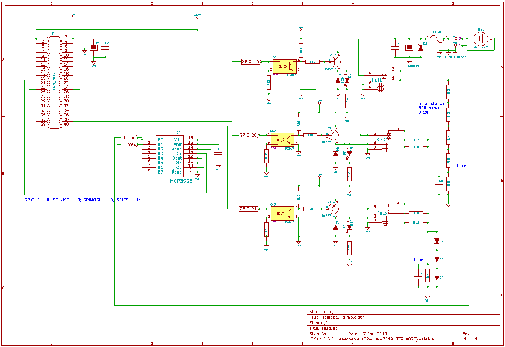

Gliders Battery check with raspberry-pi
==
Measuring the actual capacity of a battery by an controlled discharge

Contrôle des batteries de planeurs
==

Contexte:
--
La batterie du planeur, c'est la seule source d'énergie disponible à bord pendant tout un vol qui peut durer de 5 minutes à 10 heures avec des vols habituels de 3 à 5 heures.  
Il est donc important de savoir sur quelle quantité d'énergie on peut compter.  
Tous les instruments de base du pilotage fonctionnent avec des pressions d'air ( statique, dynamique   …), la batterie n'est pas « vitale » pour assurer le pilotage mais est devenue indispensable en terme de sécurité.  
La batterie a été introduite dans un premier temps afin de faire fonctionner la radio, puis les variomètres électroniques sont apparus puis les calculateurs de vols avec GPS, et enfin les systèmes anti-collision (Flarm).  
Certain planeurs sont même aujourd'hui équipés de transpondeurs et de feux à éclats afin d'être vus plus tôt par les autres  pilotes.  
Compte tenu de tout ces équipements, la consommation moyenne lors d'un vol est comprise entre 0,5 et 1 A ( 2 à 3 A de plus lors d'un message radio.)  
C'est pourquoi on dispose à bord d'une ou deux batteries ( voir 3) de 7 ou 14 A/H, elles ont amovibles et rechargées systématiquement après chaque vol dans un local dédié à cet usage.  
Actuellement les batteries plomb étanches sont les plus courantes.  

Lors des visites annuelles pendant la période hivernale, j'ai conçu ce testeur afin d'avoir l'image la plus juste  
de l'état de la batterie et de déceler à coup sur les batteries défectueuses.

Principe :
--
Le principe est de prendre une batterie chargée et de la décharger au 1/10 de sa capacité  
(correspondant grosso-modo aux conditions de vol) pendant une durée max de 10 heures  
avec arrêt automatique du test si la tension batterie descend au dessous de 11 V.  
Les mesures et un graph de suivi sont effectuées toutes les minutes via une tache cron,  
le paramétrage, la commande du test et la visualisation sont réalisés via une interface web  
et les données stockées sur une base rrd.  
Afin de ne pas trop surcharger le RPI le serveur web utilisé sera **lighttpd.**  
Toute la gestion et le paramétrage du test se fera donc depuis une page web:  
  

Hardware:
--
Le hardware est basé sur le populaire Raspberry-PI , à l'origine un modèle B  
mais est tout à fait transposable sur un B+, un 2 et même testé sur un PI-0.
J'ai créé une platine complémentaire comportant des relais de commutation de la batterie et des résistances de décharge,  
un convertisseur analogique numérique, des systèmes de protection,  
avec en option une horloge RTC, un mini écran 2,5" afin de rendre l'appareil autonome.
#### Schéma de base de la platine interface:

#### Fonctionnement
Au départ du test, le relais Rel1 est collé ce qui connecte la tension batterie au circuit de mesure de la tension.  
En fonction de la capacité de la batterie à mesurer, un ou 2 bancs de charge sont connectés à la batterie via les relais Rel2 et Rel3.  
Pour une facilité d'approvisionnement et un faible coût, le choix s'est porté sur des résistances de 47 ohms 4W mises en parallèle.  
Pour un banc de charge, on a donc une valeur de (47 / 2) +1 = **24.5 ohms**  
Ce qui donne une intensité débité à 12V de 12 / 24.5 = environ **0.49 A**  
Lorsque 2 bancs seront connectés on aura alors (47 / 4) +1 = **12.75 ohms** soit un débit de **0.95 A** environ.  
Le +1 est la valeur de la résistance shunt aux bornes de laquelle on mesurera une tension représentative de l'intensité débitée.  
La puissance débitée pour chaque résistance sera de P = U2/R  soit environ 3W pour 12V.  
En ce qui concerne l'intensité, celle ci est mesurée grâce à la chute de tension aux bornes de la résistance shunt de 1 ohm 5W  
la loi d'Ohm justement s'applique: U= R X I , pour un courant de 1A on mesurera 1V.  
#### Protections du Circuit
La protection du RaspberryPi, et de l'ADC qui communique avec lui, a été grandement prise en compte.  
Etant donné que les niveaux des entrées de l'ADC MCP3008 ne doivent pas dépasser Vref qui est ici placé au 3.3V,  
la tension de la batterie passe d'abord par un pont diviseur par 5 composé de 5 résistances de 500 ohms précision 0.1%  
(facilité d'approvisionnement et faible coût).  
Il en résulte que la tension maximum admissible en entrée est égale à 3.3V X 5 = **16,5V.**  
Même si cette tension de devrait jamais être atteinte avec un chargeur régulé digne de ce nom,  
une protection par une diode zener de 15V a été mise en place.  
En cas de dépassement de la tension de 15V la diode se mettra à conduire ce qui entraînera  
la fusion du fusible qui déconnectera de fait la batterie.  
D'autre part, le logiciel déconnectera également l'entrée via le relais Rel1 en cas de dépassement  
des 15V et donc avant que l'intensité soit suffisante pour faire claquer le fusible.  
Pour la mesure de l'intensité, là aussi on ne devra pas dépasser 3.3V en entrée de l'ADC ce qui limite à 3.3A l'intensité maximum mesurable.  
En cas de court-circuit ou de fausse manip, la tension aux bornes de la résistance shunt sera limité à environ 1.8V  
car les 3 diodes de 0.6V en série se mettront à conduire limitant le courant maximum mesurable à **1.8A** au delà le fusible de 2A assurera sa fonction.  
La aussi choix dicté par facilité d'approvisionnement et faible coût, une diode zener de 1.8 à 2 V et P > 2W  n'étant pas facile à trouver.
#### Protections de la batterie
Pour une batterie au plomb,  il n'est pas conseillé de laisser descendre la tension en dessous de 11V, aussi à chaque mesure,  
toutes les minutes, si la tension descend en dessous ce ce seuil, le test s'arrêtera et les relais déconnecterons les charges et la batterie.  
D'autre part, une durée de 10h max de décharge est prévue afin d'être représentatif d'une utilisation et de ne pas aller au bout de la capacité de la batterie.  
Pour une batterie de 7AH on mesurera donc jusqu'à 0.49 X 10 = **4.9AH**  
Pour une batterie de 14AH on mesurera donc jusqu'à 0.95 X10 = **9.5AH**  
Bien sûr un choix de résistances ou de timing différent pourra être adapté à chaque besoin.  

Software:
--
L'applicatif utilise une page web php qui renseigne un fichier d'échange et assure la visualisation instantanée de l'avancement du test  
et  un programme en python qui assure le contrôle, les mesures et le stockage des données.  
Les données seront stockées en base rrd (ne nécessitant pas de maintenance).  
L'utilitaire rrdgraph sera utilisé pour générer les graphiques.  

Il est important d'adapter les pins pour le pseudo SPI de l'adc ainsi que les canaux ADC utiisés  
dans home/pi/adc/userParam.py

Le programme devra se trouver dans /home/pi/adc sinon modifier les liens en conséquence dans  
testbat.sh, userParam.py, html/params.inc.php.

Une tache cron devra lancer toutes les minutes le script qui appelle le programme python de mesures puis le script qui construit les graphiques.  
[dans le cron de root sinon gérer les autorisations  pour les gpio]  
    # m h  dom mon dow   command
    * * * * *  /bin/sh /home/pi/adc/testbat.sh > /dev/null 2>&1
 
Pour accéder à la page web il faudra créer un lien symbolique entre le "server.document-root"  
(trouvé dans /etc/lighttpd/lighttpd.conf) et le dossier /home/pi/adc/html

Pour valider le php executer  
    sudo lighttpd-enable-mod fastcgi fastcgi-php  
    sudo /etc/init.d/lighttpd force-reload  
    
Afin de ne pas trop écrire dans la carte SD, les graphs sont générés dans /tmp/pi/bat.  
Donc il faut créer un lien symbolique dans /home/pi/adc/html/img/  
    ln -s /tmp/pi/bat/ubatr.png .
    
Paquets nécessaires (liste non exhaustive)
--
pyhton, rrdtool, python-rrdtool, lighttpd, php5-cgi

Paquets optionnels (liste non exhaustive)
git 

Exemples:
--
#### Un test sur une bonne batterie:

#### Un test sur une batterie HS:

